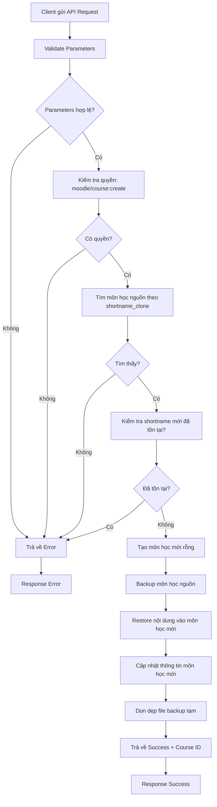
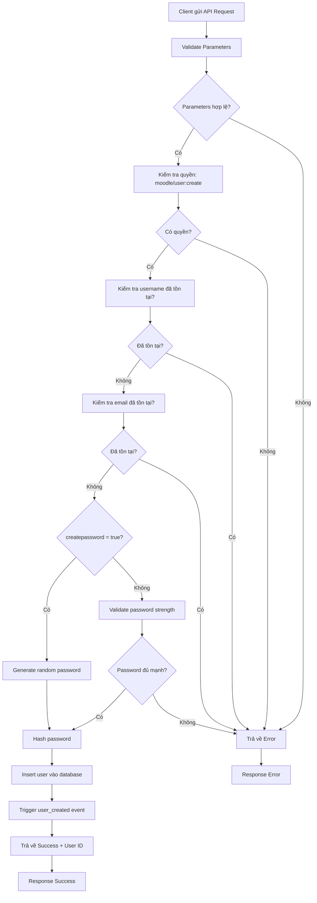

# API Services - Moodle Web Services Plugin

## Overview

Plugin **API Services** cung cấp các web services API để quản lý Course và User trong Moodle. Plugin này gộp chức năng của 2 services:
- **Course Copy Service** - Copy môn học với thông tin mới
- **User Creation Service** - Tạo người dùng mới

## Features

### 1. Course Copy API
- Copy đầy đủ nội dung môn học từ một môn học nguồn với các thông tin mới
- Giữ nguyên cấu trúc, cài đặt và format của môn học nguồn
- Tự động sao chép tất cả:
  - Activities (bài tập, quiz, forum, v.v.)
  - Resources (files, pages, URLs, v.v.)
  - Blocks
  - Sections và course format options
  - Role assignments và users
  - Comments, badges, calendar events
  - User completion data
- Sử dụng Moodle Backup/Restore API để đảm bảo tính toàn vẹn

### 2. User Creation API
- Tạo người dùng mới với đầy đủ thông tin
- Hỗ trợ tự động tạo password hoặc tự định nghĩa
- Kiểm tra tính hợp lệ của username, email và password

## Architecture - Kiến trúc hệ thống

### Request Flow

```
Client (Postman/App)
    ↓ HTTP POST Request
[RESTful Server] (webservice/restful/server.php/{function_name})
    ↓ Validate Token
[Web Services API] (Moodle Core)
    ↓ Route to Function
[External Functions] (externallib.php)
    ↓ Validate Parameters & Capabilities
[Business Logic]
    ├─ Course Copy: Backup/Restore API
    └─ User Create: User Management API
    ↓ Database Operations
[Moodle Database]
    ↓ Return Result
[Response] JSON Format
    ↓
Client receives response
```

### Security Layers

1. **Token Authentication**
   - Mỗi request phải có token hợp lệ trong header
   - Token được tạo từ Web Services settings

2. **Capability Checks**
   - Course Copy: Yêu cầu `moodle/course:create`
   - User Create: Yêu cầu `moodle/user:create`

3. **Parameter Validation**
   - Validate type, format, required fields
   - Sử dụng `external_function_parameters`

4. **Context Validation**
   - Validate context level (system, course, module)
   - Ensure user has access to context

5. **Database Transactions**
   - Atomic operations để đảm bảo data integrity
   - Rollback nếu có lỗi

## Installation

1. Copy thư mục `apiservices` vào thư mục `local/` của Moodle
2. Truy cập Site Administration → Notifications để cài đặt plugin
3. Cấu hình Web Services theo hướng dẫn trong [SETUP_GUIDE.md](SETUP_GUIDE.md)

## Workflow - Luồng hoạt động

### 🔄 Course Copy Workflow



#### Chi tiết các bước:

1. **Validate Parameters** (Bước 1)
   - Kiểm tra shortname_clone, fullname, shortname không trống
   - Validate startdate và enddate là timestamp hợp lệ
   - Kiểm tra enddate > startdate

2. **Check Capabilities** (Bước 2)
   - Yêu cầu quyền `moodle/course:create`
   - Context: System level

3. **Find Source Course** (Bước 3)
   - Query database: `SELECT * FROM {course} WHERE shortname = ?`
   - Nếu không tìm thấy → Error

4. **Check Shortname Uniqueness** (Bước 4)
   - Query: `SELECT * FROM {course} WHERE shortname = ?`
   - Nếu đã tồn tại → Error

5. **Create Empty Course** (Bước 5)
   - Sử dụng `create_course()` API
   - Copy các thuộc tính từ môn học nguồn (category, format, visible, etc.)
   - Set fullname, shortname, startdate, enddate mới

6. **Backup Source Course** (Bước 6)
   - Sử dụng Moodle Backup API: `backup_controller`
   - Backup type: `TYPE_1COURSE`
   - Format: `FORMAT_MOODLE`
   - Mode: `MODE_GENERAL`
   - Backup toàn bộ: Activities, Resources, Blocks, Users, Roles, Comments, Badges, Calendar events

7. **Restore to New Course** (Bước 7)
   - Sử dụng Moodle Restore API: `restore_controller`
   - Target: `TARGET_CURRENT_ADDING` (thêm vào course đã tạo)
   - Execute precheck trước khi restore
   - Restore toàn bộ nội dung

8. **Update Course Info** (Bước 8)
   - Update lại startdate, enddate, fullname, shortname
   - Đảm bảo thông tin chính xác

9. **Cleanup** (Bước 9)
   - Xóa file backup tạm trong temp directory
   - Release resources

10. **Return Result**
    - Success: `{status: "success", id: course_id, message: "..."}`
    - Error: `{status: "error", id: 0, message: "error_description"}`

---

### 👤 User Creation Workflow



#### Chi tiết các bước:

1. **Validate Parameters** (Bước 1)
   - Kiểm tra username, firstname, lastname, email không trống
   - Validate username format: `^[a-zA-Z0-9._-]+$`
   - Validate email format: phải là email hợp lệ

2. **Check Capabilities** (Bước 2)
   - Yêu cầu quyền `moodle/user:create`
   - Context: System level

3. **Check Username Uniqueness** (Bước 3)
   - Query: `SELECT * FROM {user} WHERE username = ?`
   - Nếu đã tồn tại → Error

4. **Check Email Uniqueness** (Bước 4)
   - Query: `SELECT * FROM {user} WHERE email = ?`
   - Nếu đã tồn tại → Error

5. **Handle Password** (Bước 5)
   - **Nếu createpassword = true**:
     - Generate random password (12 ký tự)
     - Bao gồm: a-z, A-Z, 0-9, !@#$%^&*
   - **Nếu createpassword = false**:
     - Validate password strength:
       - Tối thiểu 8 ký tự
       - Có ít nhất 1 chữ thường
       - Có ít nhất 1 chữ hoa
       - Có ít nhất 1 chữ số
     - Nếu không đủ mạnh → Error

6. **Hash Password** (Bước 6)
   - Sử dụng `hash_internal_user_password()`
   - Moodle sử dụng bcrypt để hash

7. **Create User Record** (Bước 7)
   - Prepare user object:
     ```php
     {
         username, firstname, lastname, email,
         password: hashed_password,
         confirmed: 1,
         mnethostid: CFG->mnet_localhost_id,
         auth: 'manual',
         timecreated: time(),
         timemodified: time()
     }
     ```
   - Insert vào bảng `{user}`

8. **Trigger Event** (Bước 8)
   - Fire `\core\event\user_created` event
   - Cho phép các plugin khác hook vào

9. **Return Result**
   - Success: `{status: "success", id: user_id, message: "User has been successfully created"}`
   - Error: `{status: "error", id: 0, message: "error_description"}`

---

## API Endpoints
**Function:** `local_apiservices_copy_course`

**Parameters:**
- `shortname_clone` (string) - Shortname của môn học nguồn cần copy
- `fullname` (string) - Tên đầy đủ cho môn học mới
- `shortname` (string) - Tên viết tắt cho môn học mới
- `startdate` (int) - Ngày bắt đầu (Unix timestamp)
- `enddate` (int) - Ngày kết thúc (Unix timestamp)

**Returns:**
```json
{
    "status": "success",
    "id": 123,
    "message": "Copy đầy đủ nội dung môn học thành công! ID môn học mới: 123"
}
```

### 2. Create User
**Function:** `local_apiservices_create_user`

**Parameters:**
- `username` (string) - Username cho người dùng mới
- `firstname` (string) - Tên
- `lastname` (string) - Họ
- `email` (string) - Địa chỉ email
- `createpassword` (boolean) - Tự động tạo password hay không
- `password` (string) - Password (bắt buộc nếu createpassword = false)

**Returns:**
```json
{
    "status": "success",
    "id": 456,
    "message": "User has been successfully created"
}
```

## Testing

Sử dụng Postman collection đã được cung cấp trong file `API_Services.postman_collection.json` để test các API endpoints.

### RESTful Protocol

Plugin này sử dụng **webservice_restful** protocol của Moodle:

**Endpoint Format**: `{{moodle_url}}/webservice/restful/server.php/{function_name}`

**Headers bắt buộc**:
- `Authorization`: YOUR_TOKEN (không cần 'Bearer' prefix)
- `Content-Type`: application/json
- `Accept`: application/json

**Body**: JSON format với các parameters

### Example Requests

#### 1. Copy Course Example

```bash
POST http://localhost/my/webservice/restful/server.php/local_apiservices_copy_course
Authorization: abc123def456token789
Content-Type: application/json

{
    "shortname_clone": "CS101",
    "fullname": "Introduction to Computer Science - Spring 2025",
    "shortname": "CS101-S2025",
    "startdate": 1704067200,
    "enddate": 1719792000
}
```

**Response Success:**
```json
{
    "status": "success",
    "id": 45,
    "message": "Copy đầy đủ nội dung môn học thành công! ID môn học mới: 45"
}
```

**Response Error:**
```json
{
    "status": "error",
    "id": 0,
    "message": "Shortname đã tồn tại: CS101-S2025"
}
```

#### 2. Create User Example

```bash
POST http://localhost/my/webservice/restful/server.php/local_apiservices_create_user
Authorization: abc123def456token789
Content-Type: application/json

{
    "username": "johndoe",
    "firstname": "John",
    "lastname": "Doe",
    "email": "john.doe@example.com",
    "createpassword": false,
    "password": "SecurePass123!"
}
```

**Response Success:**
```json
{
    "status": "success",
    "id": 156,
    "message": "User has been successfully created"
}
```

**Response Error:**
```json
{
    "status": "error",
    "id": 0,
    "message": "Username đã được sử dụng: johndoe"
}
```

### Common Error Responses

| Error Message | Nguyên nhân | Giải pháp |
|---------------|-------------|-----------|
| `Invalid token` | Token không hợp lệ hoặc hết hạn | Tạo token mới từ Web Services |
| `Access control exception` | Thiếu quyền (capability) | Gán quyền cho user hoặc role |
| `Shortname đã tồn tại` | Course shortname đã được sử dụng | Đổi shortname khác |
| `Username đã được sử dụng` | Username đã tồn tại | Đổi username khác |
| `Email đã được sử dụng` | Email đã tồn tại | Đổi email khác |
| `Password không đủ mạnh` | Password không đáp ứng yêu cầu | Đảm bảo password có 8+ ký tự, chữ hoa, chữ thường, số |
| `Ngày kết thúc phải sau ngày bắt đầu` | enddate <= startdate | Kiểm tra lại timestamp |

## Documentation

- [Setup Guide](SETUP_GUIDE.md) - Hướng dẫn cài đặt và cấu hình chi tiết
- [API Overview](OVERVIEW.md) - Tổng quan về các API
- [RESTful Protocol Guide](RESTFUL_GUIDE.md) - Hướng dẫn sử dụng RESTful protocol
- [Postman Collection](API_Services.postman_collection.json) - Collection để test APIs

## Requirements

- Moodle 3.8 trở lên
- Web Services được kích hoạt
- RESTful protocol được kích hoạt (webservice_restful plugin)

## Performance Considerations

### Course Copy Performance

| Course Size | Estimated Time | Notes |
|-------------|----------------|-------|
| Small (< 50 activities) | 30-60 giây | Nhanh, phù hợp cho real-time |
| Medium (50-200 activities) | 1-3 phút | Nên chạy async hoặc background |
| Large (> 200 activities) | 3-10 phút | Bắt buộc background job |

**Factors affecting performance:**
- Số lượng activities và resources
- Kích thước files trong course
- User data (enrollments, grades, completion)
- Server resources (CPU, RAM, disk I/O)

**Optimization tips:**
- Chạy course copy trong off-peak hours
- Tăng PHP memory limit nếu cần (recommend: 512MB+)
- Tăng PHP max_execution_time (recommend: 300s+)
- Sử dụng cache backend nhanh (Redis/Memcached)

### User Creation Performance

- **Single user**: < 1 giây
- **Bulk users**: Nên sử dụng batch processing
- **Rate limiting**: Recommend max 100 users/minute để tránh overload

## Best Practices

### 1. Token Management
```php
// ✅ DO: Store token securely
$token = getenv('MOODLE_API_TOKEN');

// ❌ DON'T: Hardcode token in code
$token = 'abc123def456';
```

### 2. Error Handling
```javascript
// ✅ DO: Handle errors gracefully
try {
    const response = await fetch(apiUrl, {
        method: 'POST',
        headers: {
            'Authorization': token,
            'Content-Type': 'application/json'
        },
        body: JSON.stringify(params)
    });
    
    const result = await response.json();
    
    if (result.status === 'error') {
        console.error('API Error:', result.message);
        // Handle error appropriately
    } else {
        console.log('Success:', result.message);
    }
} catch (error) {
    console.error('Network Error:', error);
}
```

### 3. Timestamp Handling
```javascript
// ✅ DO: Use proper timestamp conversion
const startDate = new Date('2025-01-01');
const startTimestamp = Math.floor(startDate.getTime() / 1000);

// ❌ DON'T: Use JavaScript timestamp directly (milliseconds)
const wrongTimestamp = Date.now(); // This is in milliseconds!
```

### 4. Course Copy Strategy
```
// ✅ DO: Verify source course exists first
1. GET course info by shortname
2. Validate source course accessible
3. Call copy_course API

// ❌ DON'T: Call copy_course blindly
1. Call copy_course API directly (may waste resources)
```

### 5. Batch Operations
```python
# ✅ DO: Use batch processing for multiple operations
import time

users = [...]  # List of users to create

for user in users:
    create_user(user)
    time.sleep(0.1)  # Rate limiting: 10 users/second

# ❌ DON'T: Fire all requests simultaneously
for user in users:
    create_user(user)  # May overload server
```

## Troubleshooting

### Issue: "Invalid token"
**Causes:**
- Token expired
- Token not activated
- Wrong token value

**Solutions:**
1. Check token exists: Site admin → Web services → Manage tokens
2. Verify token is enabled
3. Recreate token if necessary

### Issue: "Access control exception"
**Causes:**
- User doesn't have required capability
- Service not enabled for user

**Solutions:**
1. Grant capability to user/role:
   - `moodle/course:create` for course copy
   - `moodle/user:create` for user creation
2. Enable service for user in Web Services → Authorised users

### Issue: Course copy timeout
**Causes:**
- Course too large
- PHP execution timeout
- Server resources exhausted

**Solutions:**
1. Increase PHP settings:
   ```ini
   max_execution_time = 300
   memory_limit = 512M
   ```
2. Consider using Moodle scheduled task instead
3. Copy smaller courses or reduce content

### Issue: "Database error" during operations
**Causes:**
- Database connection issues
- Constraint violations
- Transaction conflicts

**Solutions:**
1. Check Moodle logs: Site admin → Reports → Logs
2. Check database server status
3. Verify database constraints (unique keys, foreign keys)
4. Retry operation after brief delay

## Monitoring & Logging

### Enable detailed logging

```php
// In config.php
$CFG->debug = DEBUG_DEVELOPER;
$CFG->debugdisplay = 0; // Don't display errors to users
$CFG->debugstringids = 0;

// Log all web service calls
$CFG->webservicelogging = 1;
```

### Check logs

1. **Web service logs**: Site admin → Reports → Web service usage
2. **System logs**: Site admin → Reports → Logs
3. **PHP error logs**: Check server PHP error log file

### Metrics to monitor

- **API response time**: Should be < 5s for normal operations
- **Error rate**: Should be < 1% in production
- **Success rate**: Should be > 99%
- **Resource usage**: Monitor CPU, RAM, disk I/O during copy operations

## License

This plugin is licensed under the GNU GPL v3 or later.

## Support

Để được hỗ trợ, vui lòng tạo issue hoặc liên hệ với đội phát triển.
